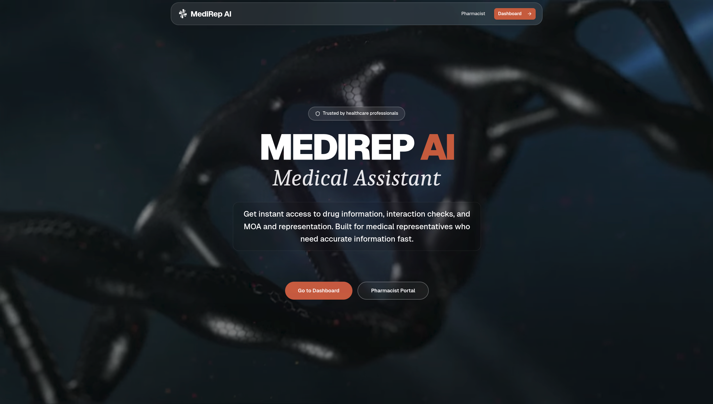
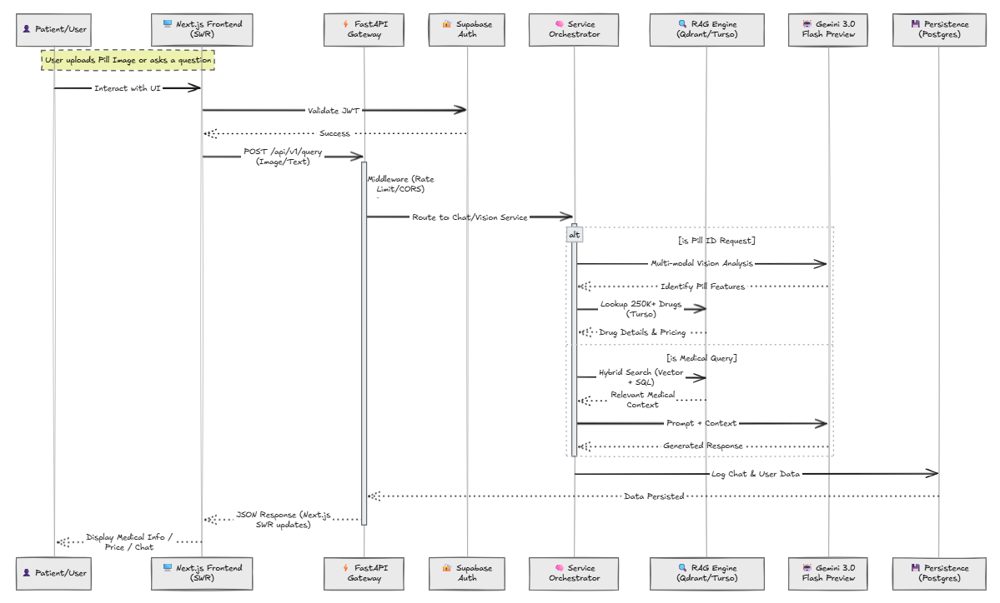
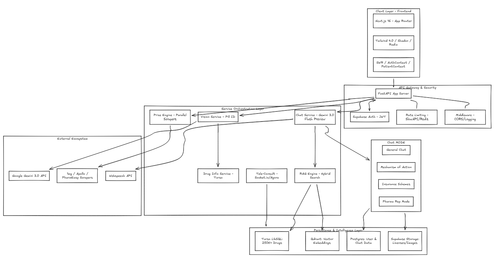

<div align="center">
  
  <h1>MediRep AI</h1>
  <p><strong>AI-Powered Medical Intelligence Platform</strong></p>
  <p>Drug information, interaction analysis, pill identification, and pharmacist consultations — powered by Gemini 3.</p>

  <a href="https://medirep-ai.vercel.app">Live Demo</a> &nbsp;|&nbsp;
  <a href="https://youtu.be/GQ4x5xrXY-g">Demo Video</a> &nbsp;|&nbsp;
  <a href="#gemini-3-integration">Gemini 3 Integration</a>

  <br/><br/>

  
  
  
  
  
  
</div>

<br/>

> **Disclaimer:** MediRep AI is for informational purposes only and is **not medical advice**. Always verify against authoritative sources and consult a qualified clinician for medical decisions.



---

## Table of Contents

- [Problem](#problem)
- [Solution](#solution)
- [Gemini 3 Integration](#gemini-3-integration)
- [Features](#features)
- [Demo Video](#demo-video)
- [Architecture](#architecture)
- [Tech Stack](#tech-stack)
- [Getting Started](#getting-started)
- [API Reference](#api-reference)
- [Project Structure](#project-structure)
- [Deployment](#deployment)
- [License](#license)

---

## Problem

Healthcare professionals in India face a fragmented information landscape:

- **250,000+ drug brands** with no unified lookup for pricing, generics, or substitutes.
- **Drug interaction checks** require cross-referencing multiple sources manually.
- **Medical representatives** lack a fast, accurate tool to detail brand portfolios during physician visits.
- **Pharmacists** have no scalable channel to offer paid consultations to patients who need expert guidance.
- **Prescription images** and **unidentified pills** still require manual interpretation with no AI-assisted workflow.

## Solution

MediRep AI is a full-stack medical intelligence platform that unifies drug data, clinical reasoning, and professional consultation into a single interface. It combines a **250K+ Indian drug database** (Turso), **vector semantic search** (Qdrant), **FDA-verified labels** (openFDA), and **Gemini 3** as the core reasoning engine across 10 distinct AI capabilities — from chat and voice to vision and pharmacokinetic analysis.

---

## Gemini 3 Integration

MediRep AI uses **`gemini-3-flash-preview`** as its primary AI engine. Gemini 3 is not a bolt-on chatbot layer — it is deeply integrated across **10 backend services** that power every core feature:

| # | Capability | Service | What Gemini 3 Does |
|---|-----------|---------|-------------------|
| 1 | **Medical Chat** | `gemini_service.py` | Context-aware Q&A with patient history, drug data, and RAG context. Supports strict execution modes (Insurance, MOA, Rep). |
| 2 | **Intent Planning** | `gemini_service.py` | Classifies user intent (INFO, SUBSTITUTE, INTERACTION, SYMPTOM) and extracts drug names/entities using structured JSON output. |
| 3 | **Patient Context Extraction** | `gemini_service.py` | Parses unstructured clinical notes into structured data (age, sex, weight, conditions, medications) via JSON response mode. |
| 4 | **Pill Identification** | `vision_service.py` | Gemini Vision analyzes pill images to extract imprint text, color, shape, size, and coating — then matches against the drug database. |
| 5 | **Prescription OCR** | `ocr_service.py` | Reads handwritten and printed Indian prescriptions, extracting medication names, dosages, and frequency abbreviations. |
| 6 | **Drug Enrichment** | `drug_service.py` | Fills missing clinical data (indications, side effects, dosage, contraindications, SMILES) when the database record is incomplete. |
| 7 | **Interaction Analysis** | `interaction_service.py` | Evaluates drug-drug and drug-condition interactions with severity classification (major/moderate/minor) and clinical recommendations. |
| 8 | **Pharmacokinetic Calculation** | `interaction_calculator.py` | Estimates AUC ratios, identifies affected CYP enzymes, and calculates interaction parameters using the formula R = 1 + ([I] / Ki). |
| 9 | **Audio Transcription** | `voice_service.py` | Fallback transcription for voice queries when the primary STT service is unavailable. |
| 10 | **Context Compression** | `context_service.py` | Summarizes long conversation histories to maintain coherent multi-turn medical discussions within token limits. |

### Gemini 3 Integration Summary

MediRep AI integrates Gemini 3 across ten backend services, making it the reasoning core of every user-facing feature. In the chat pipeline, Gemini 3 performs intent classification, entity extraction, and context-aware medical Q&A with strict execution modes for insurance reimbursement, mechanism-of-action analysis, and pharmaceutical representative detailing. The vision pipeline uses Gemini 3 for two distinct tasks: pill identification from camera images (extracting imprint, color, shape, and coating features) and prescription OCR for handwritten Indian prescriptions. Structured JSON output mode powers patient-context extraction from free-text clinical notes and drug interaction severity classification with pharmacokinetic calculations (AUC ratios, CYP enzyme identification). The drug enrichment service uses Gemini 3 to fill clinical gaps in the 250K-record database, generating indications, side effects, contraindications, and molecular formulas when records are incomplete. Context compression via Gemini 3 maintains coherent multi-turn conversations by summarizing prior exchanges while preserving drugs mentioned, patient conditions, and clinical decisions. All Gemini 3 outputs are grounded against structured data sources — openFDA labels, Turso drug records, and Qdrant vector retrieval — so responses are tied to available evidence. This architecture demonstrates deep, production-grade integration across multimodal understanding, clinical reasoning, structured extraction, and concise response generation.

---

## Features

| Feature | Description |
|---------|-------------|
| **AI Medical Chat** | Context-aware Q&A with patient history, drug database, and RAG retrieval. Supports Insurance, MOA, and Rep strict modes. |
| **Drug Search** | Search 250,000+ Indian brand/generic drugs by name, generic, or therapeutic class with vector semantic search. |
| **Interaction Checker** | Analyze drug-drug and drug-condition interactions with severity levels and clinical recommendations. |
| **Enhanced Interactions** | Pharmacokinetic AUC ratio calculations, CYP enzyme identification, and chemical structure analysis. |
| **Pill Scanner** | Identify unknown pills from camera photos using Vision AI + database matching against 250K drugs. |
| **Prescription OCR** | Extract medication details from handwritten/printed prescription images. |
| **Voice Mode** | Speech-to-text input with text-to-speech responses for hands-free operation. |
| **Patient Context** | Parse unstructured clinical notes into structured patient profiles (age, conditions, medications). |
| **Pharmacist Marketplace** | Connect with verified pharmacists for paid consultations via chat or voice (Agora). |
| **Pharma Rep Mode** | Simulate brand-specific detailing restricted to a company's actual product portfolio. |
| **Web Search** | Live web search integration for time-sensitive medical queries with source attribution. |
| **Drug Enrichment** | Auto-fill missing clinical data (indications, side effects, SMILES) from AI knowledge. |

---

## Demo Video

<div align="center">
  <a href="https://youtu.be/GQ4x5xrXY-g">
    
    <br/>
    <strong>&#9654; Watch the 3-minute demo on YouTube</strong>
  </a>
</div>

---

## System Overview

### System Data Flow

#### Request/Response Sequence



#### System Architecture




### Key Design Decisions

- **Grounded AI**: Gemini 3 outputs are always cross-referenced with structured sources (drug DB, FDA labels, vector retrieval) to minimize hallucination in medical contexts.
- **Strict Modes**: Insurance, MOA, and Rep modes constrain Gemini 3 responses to specific domains, preventing off-topic generation.
- **Graceful Degradation**: Groq serves as an automatic fallback if Gemini 3 times out or errors, ensuring the service stays available.
- **Hybrid Search**: Combines Qdrant vector similarity with Turso text search for drug lookups, covering both semantic and exact-match queries.

---

## Tech Stack

| Layer | Technology |
|-------|-----------|
| **AI Engine** | Google Gemini 3 (`gemini-3-flash-preview`) |
| **Frontend** | Next.js 16, React 19, TypeScript |
| **Styling** | Tailwind CSS 4, Shadcn/UI, Framer Motion, GSAP |
| **Backend** | FastAPI (Python 3.10+) |
| **Drug Database** | Turso (LibSQL) — 250,000+ Indian drugs |
| **Vector Search** | Qdrant Cloud (sentence-transformers/all-MiniLM-L6-v2) |
| **User Database** | Supabase (PostgreSQL + Auth) |
| **Voice** | Groq STT/TTS (primary), Gemini 3 (fallback) |
| **External Data** | openFDA Labels & Enforcement API |
| **Search** | Serper (Google) + LangSearch |
| **Payments** | Razorpay |
| **Voice Calls** | Agora RTC |
| **Email** | Resend |

---

## Getting Started

### Prerequisites

- Python 3.10+ (3.11 recommended)
- Node.js 18+ and npm
- [Gemini API Key](https://aistudio.google.com/)
- [Supabase Project](https://supabase.com/)

### Backend

```bash
git clone https://github.com/MitudruDutta/MediRep-AI
cd MediRep-AI/backend

python -m venv venv
source venv/bin/activate        # Linux/macOS
# venv\Scripts\activate         # Windows

pip install -r requirements.txt

# Copy and configure environment variables
cp .env.example .env
# Edit .env with your API keys (see Configuration below)

uvicorn main:app --reload --port 8000
```

### Frontend

```bash
cd MediRep-AI/frontend

npm install

# Create .env.local with:
# NEXT_PUBLIC_SUPABASE_URL=your_supabase_url
# NEXT_PUBLIC_SUPABASE_ANON_KEY=your_supabase_anon_key
# NEXT_PUBLIC_API_URL=http://localhost:8000
# NEXT_PUBLIC_SITE_URL=http://localhost:3000

npm run dev
```

### Access

| Service | URL |
|---------|-----|
| Frontend | `http://localhost:3000` |
| Backend API | `http://localhost:8000` |
| Swagger Docs | `http://localhost:8000/docs` |
| ReDoc | `http://localhost:8000/redoc` |

### Configuration

#### Required Environment Variables

| Variable | Description |
|----------|-------------|
| `GEMINI_API_KEY` | Google AI Studio API key |
| `GEMINI_MODEL` | Model ID (default: `gemini-3-flash-preview`) |
| `SUPABASE_URL` | Supabase project URL |
| `SUPABASE_KEY` | Supabase service role key |
| `TURSO_DATABASE_URL` | Turso database URL (drug data) |
| `TURSO_AUTH_TOKEN` | Turso auth token |
| `QDRANT_URL` | Qdrant Cloud endpoint (vector search) |
| `QDRANT_API_KEY` | Qdrant API key |

#### Optional Environment Variables

| Variable | Description |
|----------|-------------|
| `GROQ_API_KEY` | Groq API key (fallback AI + voice) |
| `SERPER_API_KEY` | Serper API key (web search) |
| `RAZORPAY_KEY_ID` | Razorpay key (payments) |
| `RAZORPAY_KEY_SECRET` | Razorpay secret (payments) |
| `AGORA_APP_ID` | Agora app ID (voice calls) |
| `RESEND_API_KEY` | Resend API key (email notifications) |

See `backend/.env.example` for the full list.

---

## API Reference

| Method | Endpoint | Description | Gemini 3 |
|--------|----------|-------------|:---------:|
| `GET` | `/health` | Health check | -- |
| `POST` | `/api/chat` | Medical AI chat (text, image, voice) | Yes |
| `GET` | `/api/drugs/search?q=` | Search 250K+ drugs | -- |
| `GET` | `/api/drugs/{name}` | Drug details with AI enrichment | Yes |
| `POST` | `/api/drugs/interactions` | Drug interaction analysis | Yes |
| `POST` | `/api/drugs/interactions/enhanced` | Pharmacokinetic interaction analysis | Yes |
| `POST` | `/api/vision/identify-pill` | Pill identification from image | Yes |
| `POST` | `/api/voice/transcribe` | Audio transcription | Fallback |
| `POST` | `/api/voice/tts` | Text-to-speech | -- |
| `POST` | `/api/context/analyze` | Patient context extraction from text | Yes |
| `GET` | `/api/alerts/{drug_name}` | FDA safety alerts | -- |

Full interactive documentation available at `/docs` (Swagger) and `/redoc` when the backend is running.

---

## Project Structure

```
MediRep-AI/
├── backend/
│   ├── main.py                          # FastAPI application entry
│   ├── config.py                        # Environment and configuration
│   ├── models.py                        # Pydantic request/response models
│   ├── dependencies.py                  # Auth middleware
│   ├── routers/
│   │   ├── chat.py                      # /api/chat
│   │   ├── drugs.py                     # /api/drugs/*
│   │   ├── vision.py                    # /api/vision/*
│   │   ├── voice.py                     # /api/voice/*
│   │   ├── context.py                   # /api/context/*
│   │   ├── consultations.py             # /api/consultations/*
│   │   ├── marketplace.py               # /api/marketplace/*
│   │   ├── pharmacist.py                # /api/pharmacist/*
│   │   └── sessions.py                  # /api/sessions/*
│   ├── services/
│   │   ├── gemini_service.py            # Core Gemini 3 integration
│   │   ├── drug_service.py              # Drug lookup + AI enrichment
│   │   ├── vision_service.py            # Pill ID (Gemini Vision)
│   │   ├── ocr_service.py               # Prescription OCR (Gemini Vision)
│   │   ├── interaction_service.py       # Drug interactions (Gemini 3)
│   │   ├── interaction_calculator.py    # Pharmacokinetic analysis (Gemini 3)
│   │   ├── voice_service.py             # STT/TTS (Groq + Gemini fallback)
│   │   ├── context_service.py           # Conversation compression (Gemini 3)
│   │   ├── rag_service.py               # RAG retrieval (Qdrant + Supabase)
│   │   ├── qdrant_service.py            # Vector search
│   │   ├── turso_service.py             # Drug database (Turso)
│   │   ├── supabase_service.py          # User data (Supabase)
│   │   ├── web_search_service.py        # Live web search
│   │   ├── moa_service.py               # Mechanism of action
│   │   ├── insurance_service.py         # Insurance/PMJAY
│   │   └── pharma_rep_service.py        # Rep mode
│   ├── requirements.txt
│   └── .env.example
├── frontend/
│   ├── app/                             # Next.js App Router
│   │   ├── auth/                        # Login / Signup
│   │   ├── dashboard/                   # Main application
│   │   │   ├── Chat/                    # AI chat interface
│   │   │   ├── drugs/                   # Drug search & details
│   │   │   └── pharmacist/              # Marketplace
│   │   └── layout.tsx
│   ├── components/
│   │   ├── dashboard/                   # Dashboard UI components
│   │   ├── PillScanner/                 # Pill identification UI
│   │   ├── ui/                          # Shadcn/UI components
│   │   └── account/                     # User profile
│   ├── lib/
│   │   ├── supabase/                    # Supabase client config
│   │   ├── api.ts                       # Backend API client
│   │   └── context/                     # React contexts
│   ├── hooks/                           # Custom React hooks
│   └── package.json
├── website.png                          # Landing page screenshot
├── image.png                            # Architecture diagram
├── LICENSE
└── README.md
```

---

## Deployment

### Production (Current)

| Service | Platform | URL |
|---------|----------|-----|
| Frontend | Vercel | [medirep-ai.vercel.app](https://medirep-ai.vercel.app) |
| Backend | Railway | Auto-deployed from `main` branch |
| Drug DB | Turso Cloud | 250K+ drugs (ap-south-1) |
| Vector DB | Qdrant Cloud | Semantic embeddings (eu-west-2) |
| User DB | Supabase | Auth + PostgreSQL |

### Deploy Your Own

**Backend (Railway)**
1. Fork this repository
2. Connect to Railway and point to `backend/`
3. Set environment variables from `.env.example`
4. Deploys automatically on push

**Frontend (Vercel)**
```bash
cd frontend && vercel
```
Set `NEXT_PUBLIC_API_URL` to your Railway backend URL.

**Docker (Optional)**
```bash
docker build -t medirep-backend ./backend
docker run -p 8000:8000 --env-file backend/.env medirep-backend
```

---

## License

MIT License — see [LICENSE](LICENSE) for details.

---

<div align="center">
  <strong>Built for better, faster medication decisions.</strong>
  <br/><br/>
  <a href="https://medirep-ai.vercel.app">Live Demo</a> &nbsp;|&nbsp;
  <a href="https://github.com/MitudruDutta/MediRep-AI">GitHub</a>
</div>
